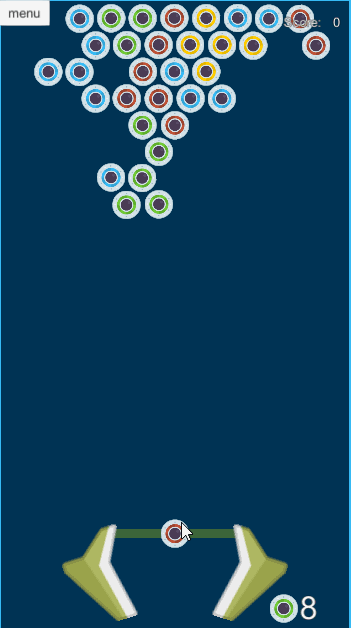
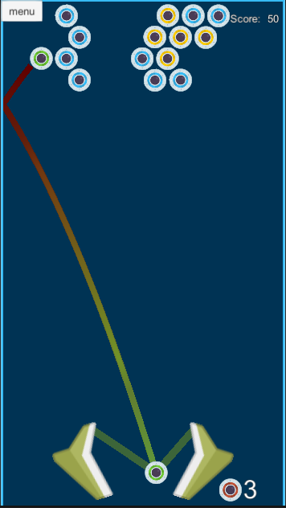
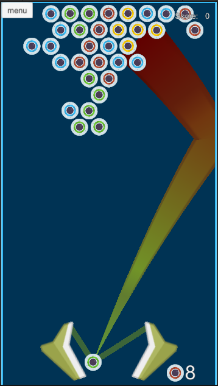
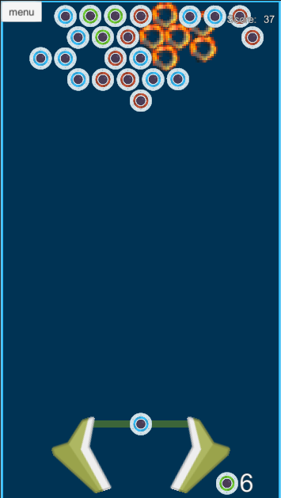

# Bubble Popper

<table>
<tr>
<td>Жанр</td><td>casual</td>
</tr>
<tr>
<td>Время на игру</td> <td>2-3 мин</td>
</tr>
<tr>
<td>Где можно сыграть</td> <td>https://sharemygame.com/@kpblcke/bubble-poper</td>
</tr>
</table>

Управление: 
мышь - захватить, отпустить шар 
 
Описание: 
Игра реализована по ТЗ - https://docs.google.com/document/d/1oUnX7wqG9gcB4PG7fcLKgNn2WkKmrvi9vb-X26W5khU/edit
Выигрыш - в последнем ряду осталось менее 30% шариков.
Проигрыш - закончились ходы

